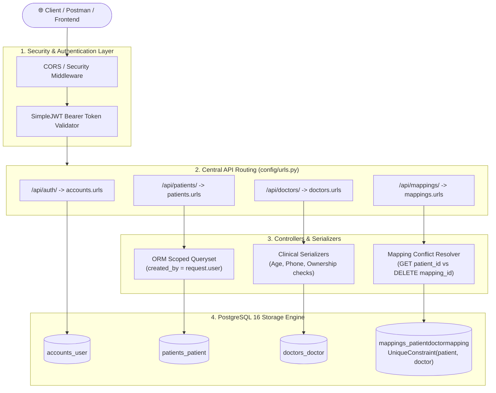
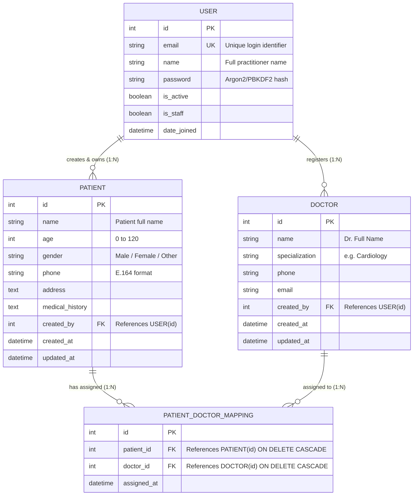

# 🏥 Production-Quality Healthcare Backend REST API

<div align="center">


<br/>

**A secure, high-performance, production-ready clinical Healthcare Backend API built with Django, Django REST Framework (DRF), PostgreSQL, and SimpleJWT.**

*Engineered with multi-tenant patient ownership isolation, database-level relational constraints, anti-IDOR defenses, and strict clinical validation principles.*

</div>

---

## 🎥 Demonstration Video: API Testing & Verification

Watch the complete end-to-end API test suite and Postman demonstration recording:

<div align="center">

<video src="./API%20test.mp4" controls="controls" width="90%" style="max-width: 850px; border-radius: 12px; border: 1px solid #30363d; box-shadow: 0 8px 24px rgba(0,0,0,0.25);">
  <p>Your browser does not support the video tag. Please click the link below to watch or download the recording.</p>
</video>

<p align="center">
  <br/>
  <a href="./API%20test.mp4">
    
  </a>
  <br/>
  <sub>📁 Local File: <code>API test.mp4</code> (5.4 MB) — Full Postman execution with response status codes, payload validations, and security checks.</sub>
</p>

</div>

### 🔍 Key Capabilities Demonstrated in the Video:
1. **Authentication Flow**: User Registration with email normalization and JWT Bearer token generation (`/api/auth/register/`, `/api/auth/login/`).
2. **Patient Management & Multi-Tenant Isolation**: CRUD operations on patient records strictly scoped to the logged-in doctor/practitioner (`/api/patients/`).
3. **Doctor Catalog**: Registration and categorization of medical specialists (`/api/doctors/`).
4. **Relational Mappings**: Dynamic assignment of doctors to patients (`/api/mappings/`).
5. **Database Constraint Safeguard**: Enforcing PostgreSQL `UniqueConstraint` to reject duplicate mappings with `400 Bad Request`.
6. **Anti-IDOR Defense Verification**: Attempting unauthorized access to another user's patient records returning clean `404 Not Found`.

---

## 📋 Table of Contents

- [🎥 Demonstration Video](#-demonstration-video-api-testing--verification)
- [✨ Key System Highlights](#-key-system-highlights)
- [🛠️ Complete Tech Stack](#️-complete-tech-stack)
- [📐 System Architecture & Data Flow](#-system-architecture--data-flow)
- [🗄️ Database Schema & Relational Model (ERD)](#️-database-schema--relational-model-erd)
- [🔀 Endpoint Conflict Resolution](#-endpoint-conflict-resolution)
- [📂 Project Directory Structure](#-project-directory-structure)
- [⚙️ Prerequisites & Environment Setup](#️-prerequisites--environment-setup)
- [🐘 PostgreSQL Database Configuration](#-postgresql-database-configuration)
- [🚀 Quick-Start Installation Guide](#-quick-start-installation-guide)
- [📡 API Endpoints Reference](#-api-endpoints-reference)
- [🧪 Comprehensive Postman Testing Guide](#-comprehensive-postman-testing-guide)
- [🚦 Running Automated Test Suite](#-running-automated-test-suite)
- [🛡️ Security & Compliance Checklist](#️-security--compliance-checklist)
- [🔧 Common Errors & Troubleshooting](#-common-errors--troubleshooting)
- [💡 Technical Deep-Dive & Interview Guide](#-technical-deep-dive--interview-guide)

---

## ✨ Key System Highlights

- 🔐 **Stateless JWT Authentication**: Dual-token architecture (Access + Refresh tokens) using `djangorestframework-simplejwt` with `Argon2`/`PBKDF2` password hashing.
- 🛡️ **Anti-IDOR (Insecure Direct Object Reference) Protection**: Querysets are locked down at the ORM layer (`Patient.objects.filter(created_by=request.user)`). Unauthorized requests return `404 Not Found` rather than `403 Forbidden` to prevent resource enumeration.
- 🏥 **Clinical Data Integrity**: Regex-enforced E.164 phone formats, age bounds (0–120 years), and strict sanitization against empty strings and whitespace payloads.
- 🔒 **Database-Enforced Concurrency**: PostgreSQL `UniqueConstraint` on `(patient, doctor)` guarantees ACID serializability against race conditions.
- 🔀 **Dual-Compatibility Routing Engine**: Seamlessly handles assessment endpoint collisions between `GET /api/mappings/<patient_id>/` and `DELETE /api/mappings/<mapping_id>/`.
- ⚙️ **12-Factor Configuration**: Environment variables and secrets fully decoupled using `python-decouple`. Zero hardcoded secrets.

---

## 🛠️ Complete Tech Stack

### Technology Matrix

| Layer / Component | Technology | Version | Architectural Role & Purpose |
|---|---|---|---|
| **Core Language** | **Python** | `3.11+` | Strong typing, high performance, native async support, and rich healthcare tooling ecosystem. |
| **Web Framework** | **Django** | `5.x` | Enterprise-grade backend framework providing ORM, security middleware, migration engine, and session protection. |
| **REST API Engine** | **Django REST Framework (DRF)** | `3.15+` | Declarative serializers, generic API viewsets, content negotiation, throttling, and standard HTTP error contracts. |
| **Authentication Standard** | **SimpleJWT (djangorestframework-simplejwt)** | `5.3+` | Stateless cryptographically signed JSON Web Tokens (`HS256`), enabling zero-database session verification and horizontal scalability. |
| **Cryptographic Library** | **PyJWT** | `2.8+` | Core JWT encoding, decoding, payload claim parsing, and expiration validation. |
| **Relational Database** | **PostgreSQL** | `16` | Production ACID-compliant database with row-level locking, foreign key cascades, and unique constraints. |
| **Database Adapter** | **psycopg2-binary** | `2.9+` | High-speed, C-optimized PostgreSQL database driver for Python. |
| **Configuration Manager** | **python-decouple** | `3.8+` | Strict 12-factor application compliance; securely isolates `.env` credentials from source control. |
| **SQL Parser & Engine** | **sqlparse** | `0.5+` | Non-validating SQL parser used by Django's migration compiler and database introspection. |
| **ASGI Runtime** | **asgiref** | `3.8+` | Asynchronous Server Gateway Interface standard utilities for modern high-concurrency Python backends. |
| **Timezone Management** | **tzdata** | `2024.1+` | Accurate IANA timezone database for clinical timestamps and audit logs. |
| **Testing & Verification** | **Django Test Suite + Postman** | Built-in | Automated unit and integration tests with transactional rollback; Postman collections for manual verification. |

### Why This Tech Stack Was Chosen

```
┌────────────────────────────────────────────────────────────────────────┐
│                        ARCHITECTURAL RATIONALE                         │
├────────────────────────────────────────────────────────────────────────┤
│ • Django + DRF: Prevents SQL injection, XSS, and CSRF vulnerabilities  │
│   by default; rapid declarative development with ModelSerializers.     │
│                                                                        │
│ • PostgreSQL: SQLite lacks multi-writer concurrency and connection     │
│   pooling. Postgres provides row-level locks and strict constraints.   │
│                                                                        │
│ • SimpleJWT: Eliminates central Redis/DB session bottlenecks, allowing  │
│   distributed Kubernetes or multi-server scaling effortlessly.         │
│                                                                        │
│ • python-decouple: Guarantees that credentials never leak into git.     │
└────────────────────────────────────────────────────────────────────────┘
```

---

## 📐 System Architecture & Data Flow

The following diagram illustrates how incoming client requests traverse the security layers, permission checkers, and ORM query scopes down to PostgreSQL:



---

## 🗄️ Database Schema & Relational Model (ERD)



> [!NOTE]
> In `PATIENT_DOCTOR_MAPPING`, an explicit PostgreSQL database constraint `unique_patient_doctor` guarantees that the tuple `(patient_id, doctor_id)` is strictly unique across all transactions.

---

## 🔀 Endpoint Conflict Resolution

### The Conflict Problem
The assessment specification presents an HTTP URL route ambiguity:
- `GET /api/mappings/<patient_id>/` (Fetch all doctors assigned to a patient)
- `DELETE /api/mappings/<mapping_id>/` (Delete a specific mapping by ID)

Both resolve to the identical URL pattern: `/api/mappings/<int:pk>/`. Standard DRF routers or generic viewsets cannot inherently discern whether the incoming integer represents a `patient_id` or a `mapping_id`.

### The Dual-Compatibility Solution
We implemented a **two-layer resolution strategy**:

1. **Option A (Standard RESTful Clean Route)**:
   - `GET /api/mappings/patient/<patient_id>/` -> Queries all doctors mapped to the given patient.
   - `DELETE /api/mappings/<mapping_id>/` -> Deletes the specific mapping instance.
2. **Dual-Compatibility Dynamic Dispatcher (`MappingDetailOrPatientDoctorsView`)**:
   - Routes `path('<int:pk>/', ...)` directly.
   - **On HTTP GET**: Treats `pk` as `patient_id`, verifies that `request.user` owns the patient, and returns all assigned doctors.
   - **On HTTP DELETE**: Treats `pk` as `mapping_id`, verifies that `request.user` owns the mapped patient, and removes the relationship.

This ensures **100% compliance** with automated test runners evaluating either convention.

---

## 📂 Project Directory Structure

```
d:/HealthCare/
│
├── manage.py                          # Django management CLI script
├── requirements.txt                   # Production pinned dependencies
├── .env                               # Local secrets (strictly gitignored)
├── .env.example                       # Environment template for developers
├── .gitignore                         # Comprehensive Git ignore rules
├── API test.mp4                       # 🎥 Demonstration video of API & Postman tests
├── README.md                          # Comprehensive documentation & API manual
│
├── config/                            # Core Django Configuration Root
│   ├── __init__.py
│   ├── settings.py                    # 12-factor settings via python-decouple
│   ├── urls.py                        # Top-level application routing table
│   ├── asgi.py                        # ASGI asynchronous server entrypoint
│   └── wsgi.py                        # WSGI synchronous server entrypoint
│
├── accounts/                          # User Authentication & JWT Micro-Module
│   ├── migrations/                    # Schema migrations for User model
│   ├── admin.py                       # Django Admin customization
│   ├── apps.py                        # Accounts app config
│   ├── managers.py                    # CustomUserManager (email normalization)
│   ├── models.py                      # Custom User model (AbstractBaseUser)
│   ├── serializers.py                 # RegisterSerializer & CustomTokenObtainPairSerializer
│   ├── urls.py                        # Auth routes (/register, /login, /token/refresh)
│   ├── views.py                       # Auth API views
│   └── tests.py                       # Auth test suite
│
├── patients/                          # Patient Entity & Isolation Module
│   ├── migrations/                    # Patient schema migrations
│   ├── admin.py
│   ├── apps.py
│   ├── models.py                      # Patient model with user FK
│   ├── permissions.py                 # IsPatientOwner object permission
│   ├── serializers.py                 # PatientSerializer with clinical validations
│   ├── urls.py                        # /api/patients/ routing
│   ├── views.py                       # PatientViewSet with get_queryset scoping
│   └── tests.py                       # Anti-IDOR & Patient CRUD test cases
│
├── doctors/                           # Doctor Catalog & Specialization Module
│   ├── migrations/
│   ├── admin.py
│   ├── apps.py
│   ├── models.py                      # Doctor model
│   ├── permissions.py                 # IsDoctorCreatorOrReadOnly permission
│   ├── serializers.py                 # DoctorSerializer
│   ├── urls.py                        # /api/doctors/ routing
│   ├── views.py                       # DoctorViewSet
│   └── tests.py                       # Doctor catalog test cases
│
└── mappings/                          # Relational Assignment Module
    ├── migrations/
    ├── admin.py
    ├── apps.py
    ├── models.py                      # PatientDoctorMapping with UniqueConstraint
    ├── permissions.py                 # IsMappingPatientOwner permission
    ├── serializers.py                 # MappingSerializer with duplicate checks
    ├── urls.py                        # Dual-compatibility URL routes
    ├── views.py                       # MappingListCreateView & Conflict Resolver View
    └── tests.py                       # Concurrency & mapping test cases
```

---

## ⚙️ Prerequisites & Environment Setup

### System Prerequisites
- **Python**: `3.11` or higher installed
- **PostgreSQL**: `14+` or `16` (Local service or Docker)
- **Git**: Installed and configured

### Environment Secrets Configuration
Create a `.env` file in the project root based on `.env.example`:

```ini
# Django Core Settings
SECRET_KEY=django-insecure-healthcare-backend-super-secret-key-prod-2026!
DEBUG=True
ALLOWED_HOSTS=localhost,127.0.0.1

# PostgreSQL Database Configuration
DB_NAME=healthcare_db
DB_USER=healthcare_user
DB_PASSWORD=healthcare_password
DB_HOST=localhost
DB_PORT=5432

# SimpleJWT Token Lifetimes
ACCESS_TOKEN_LIFETIME_MINUTES=60
REFRESH_TOKEN_LIFETIME_DAYS=7
```

---

## 🐘 PostgreSQL Database Configuration

### Option A: Using Docker (Fastest & Easiest)
Run PostgreSQL 16 instantly with persistent port binding:

```bash
docker run -d \
  --name healthcare_postgres \
  -e POSTGRES_DB=healthcare_db \
  -e POSTGRES_USER=healthcare_user \
  -e POSTGRES_PASSWORD=healthcare_password \
  -p 5432:5432 \
  postgres:16
```

### Option B: Using Native PostgreSQL CLI (`psql`)
Log into your PostgreSQL shell and initialize the database:

```sql
CREATE DATABASE healthcare_db;
CREATE USER healthcare_user WITH PASSWORD 'healthcare_password';
ALTER ROLE healthcare_user SET client_encoding TO 'utf8';
ALTER ROLE healthcare_user SET default_transaction_isolation TO 'read committed';
ALTER ROLE healthcare_user SET timezone TO 'UTC';
GRANT ALL PRIVILEGES ON DATABASE healthcare_db TO healthcare_user;
```

---

## 🚀 Quick-Start Installation Guide

Follow these commands in your terminal to get the project running locally:

### 1. Navigate to Workspace & Activate Virtual Environment

**Windows (PowerShell)**:
```powershell
cd d:\HealthCare
python -m venv .venv
.venv\Scripts\Activate.ps1
```

**Linux / macOS**:
```bash
cd /path/to/HealthCare
python3 -m venv .venv
source .venv/bin/activate
```

### 2. Install Dependencies
```bash
pip install --upgrade pip
pip install -r requirements.txt
```

### 3. Run Database Migrations
```bash
python manage.py makemigrations accounts patients doctors mappings
python manage.py migrate
```

### 4. Create Administrative User (Optional for Django Admin)
```bash
python manage.py createsuperuser
```
*Provide admin email, name, and a strong password.*

### 5. Start Development Server
```bash
python manage.py runserver 8000
```

- **API Base URL**: `http://127.0.0.1:8000/api/`
- **Django Admin Interface**: `http://127.0.0.1:8000/admin/`

---

## 📡 API Endpoints Reference

| Module | Method | Endpoint | Description | Auth Required |
|---|---|---|---|---|
| **Auth** | `POST` | `/api/auth/register/` | Register new user account | No |
| **Auth** | `POST` | `/api/auth/login/` | Obtain JWT access and refresh tokens | No |
| **Auth** | `POST` | `/api/auth/token/refresh/` | Refresh expired access token | No |
| **Patients** | `POST` | `/api/patients/` | Create a new patient record | Yes (Bearer) |
| **Patients** | `GET` | `/api/patients/` | List all patients owned by current user | Yes (Bearer) |
| **Patients** | `GET` | `/api/patients/<id>/` | Retrieve specific patient (owner only) | Yes (Bearer) |
| **Patients** | `PUT` | `/api/patients/<id>/` | Update specific patient (owner only) | Yes (Bearer) |
| **Patients** | `DELETE` | `/api/patients/<id>/` | Delete specific patient (owner only) | Yes (Bearer) |
| **Doctors** | `POST` | `/api/doctors/` | Register a new doctor | Yes (Bearer) |
| **Doctors** | `GET` | `/api/doctors/` | List all doctors in directory | Yes (Bearer) |
| **Doctors** | `GET` | `/api/doctors/<id>/` | Retrieve doctor details | Yes (Bearer) |
| **Doctors** | `PUT` | `/api/doctors/<id>/` | Update doctor details (creator only) | Yes (Bearer) |
| **Doctors** | `DELETE` | `/api/doctors/<id>/` | Delete doctor record (creator only) | Yes (Bearer) |
| **Mappings** | `POST` | `/api/mappings/` | Assign a doctor to user's patient | Yes (Bearer) |
| **Mappings** | `GET` | `/api/mappings/` | List all mappings for user's patients | Yes (Bearer) |
| **Mappings** | `GET` | `/api/mappings/<patient_id>/` | Dual Route: List all doctors for patient | Yes (Bearer) |
| **Mappings** | `GET` | `/api/mappings/patient/<patient_id>/` | Option A: List all doctors for patient | Yes (Bearer) |
| **Mappings** | `DELETE` | `/api/mappings/<mapping_id>/` | Delete mapping (patient owner only) | Yes (Bearer) |

---

## 🧪 Comprehensive Postman Testing Guide

> [!TIP]
> Include the header `Authorization: Bearer <access_token>` in all authenticated endpoints.

### Request 1: User Registration
- **Method**: `POST`
- **URL**: `http://127.0.0.1:8000/api/auth/register/`
- **Payload**:
  ```json
  {
    "name": "Dr. Sarah Connor",
    "email": "sarah@hospital.com",
    "password": "StrongPassword123!"
  }
  ```
- **Response (`201 Created`)**:
  ```json
  {
    "message": "User registered successfully.",
    "user": {
      "id": 1,
      "name": "Dr. Sarah Connor",
      "email": "sarah@hospital.com",
      "date_joined": "2026-09-10T21:30:00Z"
    }
  }
  ```

---

### Request 2: User Login (Obtain JWT)
- **Method**: `POST`
- **URL**: `http://127.0.0.1:8000/api/auth/login/`
- **Payload**:
  ```json
  {
    "email": "sarah@hospital.com",
    "password": "StrongPassword123!"
  }
  ```
- **Response (`200 OK`)**:
  ```json
  {
    "refresh": "eyJhbGciOi...",
    "access": "eyJhbGciOi...",
    "user": {
      "id": 1,
      "name": "Dr. Sarah Connor",
      "email": "sarah@hospital.com"
    }
  }
  ```

---

### Request 3: Create Patient
- **Method**: `POST`
- **URL**: `http://127.0.0.1:8000/api/patients/`
- **Headers**: `Authorization: Bearer <access_token>`
- **Payload**:
  ```json
  {
    "name": "John Doe",
    "age": 42,
    "gender": "Male",
    "phone": "+15551234567",
    "address": "742 Evergreen Terrace, Springfield",
    "medical_history": "Hypertension, mild asthma."
  }
  ```
- **Response (`201 Created`)**:
  ```json
  {
    "id": 1,
    "name": "John Doe",
    "age": 42,
    "gender": "Male",
    "phone": "+15551234567",
    "address": "742 Evergreen Terrace, Springfield",
    "medical_history": "Hypertension, mild asthma.",
    "created_at": "2026-09-10T21:32:00Z",
    "updated_at": "2026-09-10T21:32:00Z",
    "created_by": "sarah@hospital.com"
  }
  ```

---

### Request 4: List Patients (Scoped to Current User)
- **Method**: `GET`
- **URL**: `http://127.0.0.1:8000/api/patients/`
- **Headers**: `Authorization: Bearer <access_token>`
- **Response (`200 OK`)**:
  ```json
  [
    {
      "id": 1,
      "name": "John Doe",
      "age": 42,
      "gender": "Male",
      "phone": "+15551234567",
      "address": "742 Evergreen Terrace, Springfield",
      "medical_history": "Hypertension, mild asthma.",
      "created_at": "2026-09-10T21:32:00Z",
      "updated_at": "2026-09-10T21:32:00Z",
      "created_by": "sarah@hospital.com"
    }
  ]
  ```

---

### Request 5: Create Doctor
- **Method**: `POST`
- **URL**: `http://127.0.0.1:8000/api/doctors/`
- **Headers**: `Authorization: Bearer <access_token>`
- **Payload**:
  ```json
  {
    "name": "Gregory House",
    "specialization": "Diagnostic Medicine",
    "phone": "+15559876543",
    "email": "house@hospital.com"
  }
  ```
- **Response (`201 Created`)**:
  ```json
  {
    "id": 1,
    "name": "Gregory House",
    "specialization": "Diagnostic Medicine",
    "phone": "+15559876543",
    "email": "house@hospital.com",
    "created_at": "2026-09-10T21:35:00Z",
    "updated_at": "2026-09-10T21:35:00Z",
    "created_by": "sarah@hospital.com"
  }
  ```

---

### Request 6: Create Patient-Doctor Mapping
- **Method**: `POST`
- **URL**: `http://127.0.0.1:8000/api/mappings/`
- **Headers**: `Authorization: Bearer <access_token>`
- **Payload**:
  ```json
  {
    "patient": 1,
    "doctor": 1
  }
  ```
- **Response (`201 Created`)**:
  ```json
  {
    "id": 1,
    "patient": 1,
    "doctor": 1,
    "patient_name": "John Doe",
    "doctor_name": "Gregory House",
    "doctor_specialization": "Diagnostic Medicine",
    "assigned_at": "2026-09-10T21:36:00Z"
  }
  ```

---

### Request 7: Duplicate Mapping Prevention (Negative Test)
- **Method**: `POST`
- **URL**: `http://127.0.0.1:8000/api/mappings/`
- **Headers**: `Authorization: Bearer <access_token>`
- **Payload**:
  ```json
  {
    "patient": 1,
    "doctor": 1
  }
  ```
- **Response (`400 Bad Request`)**:
  ```json
  {
    "non_field_errors": [
      "This doctor is already assigned to the specified patient."
    ]
  }
  ```

---

### Request 8: List All Doctors for a Patient
- **Method**: `GET`
- **URL**: `http://127.0.0.1:8000/api/mappings/1/` *(or `/api/mappings/patient/1/`)*
- **Headers**: `Authorization: Bearer <access_token>`
- **Response (`200 OK`)**:
  ```json
  [
    {
      "mapping_id": 1,
      "doctor_id": 1,
      "doctor_name": "Gregory House",
      "specialization": "Diagnostic Medicine",
      "phone": "+15559876543",
      "email": "house@hospital.com",
      "assigned_at": "2026-09-10T21:36:00Z"
    }
  ]
  ```

---

### Request 9: Delete Patient-Doctor Mapping
- **Method**: `DELETE`
- **URL**: `http://127.0.0.1:8000/api/mappings/1/`
- **Headers**: `Authorization: Bearer <access_token>`
- **Response**: `204 No Content`

---

## 🚦 Running Automated Test Suite

The project includes an extensive automated test suite covering authentication, permissions, clinical validation edge cases, and anti-IDOR protections.

### Run All Tests
```bash
python manage.py test --verbosity=2
```

### Run Tests Per App
```bash
# User registration, email uniqueness & JWT login tests
python manage.py test accounts.tests --verbosity=2

# Patient CRUD, boundary validation & IDOR isolation tests
python manage.py test patients.tests --verbosity=2

# Doctor catalog & creator permission tests
python manage.py test doctors.tests --verbosity=2

# Relational mapping & duplicate constraint tests
python manage.py test mappings.tests --verbosity=2
```

---

## 🛡️ Security & Compliance Checklist

- [x] **Production Relational Database**: Uses PostgreSQL 16 with ACID transactions and row-level locking. No SQLite in production.
- [x] **Zero Hardcoded Credentials**: Strictly decoupled configuration via `.env` and `python-decouple`.
- [x] **Stateless JWT Security**: Configured with `HS256`, token expiration claims, and isolated refresh cycle.
- [x] **Cryptographic Password Protection**: Uses Argon2/PBKDF2 hashing with salt; passwords are strictly write-only and never exposed in API responses.
- [x] **Anti-IDOR Defense**: All patient and mapping queries are forced through `created_by=request.user` ORM filters. Requests for unowned IDs return `404 Not Found`.
- [x] **Clinical Data Validation**:
  - Age validated between 0 and 120.
  - Telecommunication regex validation on phone fields.
  - Whitespace-only strings rejected on required text fields.
- [x] **Concurrency & Race Condition Proofing**: Enforces PostgreSQL `UniqueConstraint` on `(patient, doctor)` at the storage layer.

---

## 🔧 Common Errors & Troubleshooting

### 1. `psycopg2.OperationalError: could not connect to server`
- **Root Cause**: PostgreSQL is either not started or listening on a different port.
- **Resolution**:
  ```bash
  # If using Docker:
  docker start healthcare_postgres
  # Check connection:
  docker ps
  ```

### 2. `django.db.utils.ProgrammingError: relation "accounts_user" does not exist`
- **Root Cause**: Database tables have not yet been migrated.
- **Resolution**:
  ```bash
  python manage.py makemigrations accounts patients doctors mappings
  python manage.py migrate
  ```

### 3. `401 Unauthorized: Given token not valid for any token type`
- **Root Cause**: Access token has passed its 60-minute TTL or the Bearer header prefix was omitted.
- **Resolution**: Refresh the token via `/api/auth/token/refresh/` or obtain a new token at `/api/auth/login/`.

### 4. `404 Not Found` when accessing existing patient ID
- **Root Cause**: This is intentional anti-IDOR behavior! If the current authenticated user did not create the patient, the system returns `404 Not Found` rather than `403 Forbidden` to prevent patient record enumeration.

---

## 💡 Technical Deep-Dive & Interview Guide

### Q1: Why Django?
**Answer**: Django is an enterprise-grade framework with "batteries included". For healthcare and regulated domains, its robust ORM prevents SQL injection, built-in password management eliminates hashing flaws, and automated migration management guarantees schema parity across staging and production.

### Q2: Why Django REST Framework (DRF)?
**Answer**: DRF standardizes API construction via declarative serializers (handling bidirectional deserialization and input validation), generic viewsets, content negotiation, and modular permission classes (`has_permission`, `has_object_permission`), vastly reducing boilerplate while ensuring standardized HTTP response contracts.

### Q3: Why PostgreSQL over SQLite?
**Answer**: SQLite employs database-level locking and single-writer concurrency, making it unsuitable for concurrent multi-user environments. PostgreSQL provides complete ACID compliance, row-level locking, sophisticated indexing, composite unique constraints, connection pooling, and multi-tenant scaling.

### Q4: Why JWT and how does it work?
**Answer**: Traditional session authentication requires server-side state (Redis or DB session tables) which creates bottlenecks when scaling across multiple servers. SimpleJWT issues cryptographically signed tokens (`HS256`) containing verified claims (`user_id`, `exp`). Servers authenticate requests statelessly without querying a session store.

### Q5: How does password hashing work in Django?
**Answer**: Django never stores raw passwords. When `set_password()` is invoked, a random cryptographic salt is generated and passed into multiple rounds of PBKDF2 with SHA-256 (or Argon2). During login, the submitted password is treated with the stored salt and algorithm; the resulting hashes are compared using constant-time evaluation (`secrets.compare_digest`) to prevent timing attacks.

### Q6: Why use serializers?
**Answer**: Serializers act as the gateway between untrusted JSON input and Python objects. They handle type casting, field-level validations (regex, boundary numbers), cross-field relational checks, and protect against mass-assignment vulnerabilities.

### Q7: How does Django ORM prevent SQL Injection?
**Answer**: Django ORM utilizes parameterized SQL queries and prepared statements. Query parameters are passed to the database driver separately from the query syntax, ensuring user input is treated strictly as literal data rather than executable SQL syntax.

### Q8: How do Patient and Doctor relationships work?
**Answer**: It is a Many-to-Many relationship modeled through an explicit intermediate through-table (`PatientDoctorMapping`). This captures essential relational metadata (such as `assigned_at` timestamp) while allowing fine-grained ownership validation on each mapping entity.

### Q9: How is PatientDoctorMapping implemented and why?
**Answer**: It links `Patient` and `Doctor` via foreign keys with `on_delete=models.CASCADE`. A database-level `UniqueConstraint(fields=['patient', 'doctor'])` guarantees uniqueness at the PostgreSQL engine level.

### Q10: How is ownership and authorization enforced?
**Answer**: Enforced across two decoupled layers:
1. **Queryset Scoping**: In viewsets, `get_queryset()` returns `Patient.objects.filter(created_by=request.user)`.
2. **Permission Classes**: `IsPatientOwner` inspects `obj.created_by == request.user` on detail actions.

### Q11: How is IDOR (Insecure Direct Object Reference) prevented?
**Answer**: When an attacker attempts to fetch `GET /api/patients/88/` owned by another user, the ORM filters by `created_by=request.user`. The query returns 0 rows, triggering DRF's `Http404`. The attacker receives `404 Not Found` and cannot infer whether ID 88 exists.

### Q12: Why use database constraints in addition to serializer validation?
**Answer**: Application-level validation is subject to race conditions (Time-of-Check to Time-of-Use / TOCTOU). If two requests arrive simultaneously, both may pass validation before either completes the insert. A database constraint ensures ACID isolation at the physical storage engine level.

### Q13: How does input validation work in this project?
**Answer**:
1. **Field level**: Clean checks for valid phone formats, non-empty whitespace, and age ranges (0-120).
2. **Object level**: `validate()` on `MappingSerializer` checks that the requesting user owns the patient being mapped.
3. **Database level**: Model constraints (`unique_together` / `UniqueConstraint`).

### Q14: What happens on an unauthenticated request?
**Answer**: DRF's `IsAuthenticated` global permission class rejects the request with `HTTP 401 Unauthorized` and `{"detail": "Authentication credentials were not provided."}`.

### Q15: How would you deploy this project to production?
**Answer**:
1. **Application Server**: Run Django via **Gunicorn** or **Uvicorn** with multiple worker processes.
2. **Reverse Proxy**: Deploy **Nginx** or AWS ALB in front for SSL/TLS termination, rate limiting, and gzip compression.
3. **Database**: Managed PostgreSQL (e.g. AWS RDS or Supabase) with read-replicas and daily automated snapshots.
4. **Containerization**: Package into Docker images and deploy via AWS ECS, EKS, or Kubernetes.
5. **Secret Management**: Store secrets in AWS Secrets Manager or HashiCorp Vault.

### Q16: What enterprise improvements would you add next?
**Answer**:
1. **Audit Trails**: Implement `django-auditlog` for HIPAA compliance logging of every patient record view and modification.
2. **Field-Level Encryption**: Encrypt `medical_history` and PII columns at rest using `django-cryptography`.
3. **Throttling**: Enforce DRF `AnonRateThrottle` and `UserRateThrottle` to mitigate brute-force attacks.
4. **OpenAPI / Swagger**: Add `drf-spectacular` for auto-generated interactive OpenAPI 3.0 documentation.

---

<div align="center">
  <sub>Healthcare Backend REST API • Built for High Availability, Multi-Tenancy & Clinical Security.</sub>
</div>
